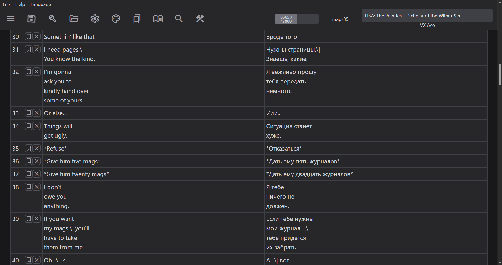

# rpgmtranslate

[README на русском](README-ru.md)

## General

A fast and light graphical interface, designed for editing and translating games based on RPG Maker XP/VX/VX Ace/MV/MZ engines.

Under the hood, this GUI uses:

- [rvpacker-txt-rs-lib](https://github.com/RPG-Maker-Translation-Tools/rvpacker-txt-rs-lib) to parse text from RPG Maker files and apply the translation.
- [marshal-rs](https://github.com/RPG-Maker-Translation-Tools/marshal-rs) to parse RPG Maker XP/VX/VX Ace files to JSON.
- [rpgm-archive-decrypter-lib](https://github.com/RPG-Maker-Translation-Tools/rpgm-archive-decrypter-lib) to decrypt `.rgss` RPG Maker XP/VX/VX Ace archives.

Using these tools, the program parses the text to `.txt` files, allows you to edit them, and then write them back to the original form with translation applied.



If you have troubled figuring out the program, check the `Help > Help` top menu option. That will probably help.

## Installation

**Download the latest version from the Releases section.**

## Usage

Documentation is available at <https://rpg-maker-translation-tools.github.io/rpgmtranslate/>.

## Manual building

### Prerequisites

- `rustup` with an installed Rust toolchain.
- Tauri prerequisites (<https://v2.tauri.app/start/prerequisites>).
- JavaScript runtime (`nodejs`, `bun`, `deno`).

### Building

Clone the repository:

```bash
git clone https://github.com/RPG-Maker-Translation-Tools/rpgmtranslate.git
```

Install JavaScript dependencies:

```bash
cd rpgmtranslate

# Use your favorite flavor
npm install # npm
bun install # bun
# etc.
```

Run/build the program:

```bash
# Run in development mode
npm run tauri dev

# Build for release
npm run tauri build
```

After the build, `target` directory will be created in the `gui/src-tauri` path, containing binary file with program build and distributable bundled packages in the `target/bundle` directory.

## Support

[Me](https://github.com/savannstm), the maintainer of this project, is a poor college student from Eastern Europe.

If you could, please consider supporting us through:

- [Ko-fi](https://ko-fi.com/savannstm)
- [Patreon](https://www.patreon.com/cw/savannstm)
- [Boosty](https://boosty.to/mcdeimos)

Even if you don't, it's fine. We'll continue to do as we right now.

## License

Project is licensed under WTFPL.

The repository contains third-party software, that is licensed under other conditions:

- `Google Material Icons` - licensed under `Apache License Version 2.0`.
