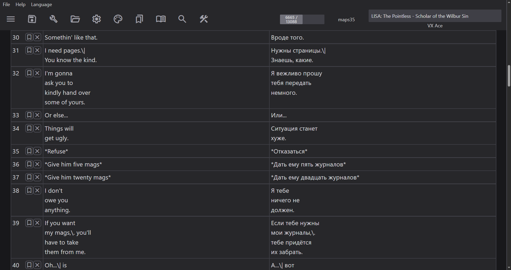

# rpgmtranslate

**Development of rpgmtranslate is abandoned due to the wrong choice of development tools. Further development is continued in [rpgmtranslate-qt](https://github.com/RPG-Maker-Translation-Tools).**

[README на русском](README-ru.md)

A fast and light graphical interface, designed for editing and translating games based on RPG Maker XP/VX/VX Ace/MV/MZ engines.

## Features

- [x] Hugely customizable interface that we're looking to make even more customizable.
- [x] Cross-platform, fast and powerful.
- [x] Fast game files parsing and fast translation writing.
- [x] Easy plain text format that's manually editable.
- [x] XP, VX, VX Ace, MV and MZ engines support.
- [x] Built-in glossary with support for ~40 languages.
- [x] Convenience features like bookmarks, shortcuts and other mindblowing tricks.
- [x] Built-in easy batch processing of files.
- [x] Integrated APIs for Google Translate, Yandex Translate, DeepL, ChatGPT, Claude, DeepSeek and Gemini.

Under the hood, this GUI uses:

- [rvpacker-txt-rs-lib](https://github.com/RPG-Maker-Translation-Tools/rvpacker-txt-rs-lib) to parse text from RPG Maker files and apply the translation.
- [marshal-rs](https://github.com/RPG-Maker-Translation-Tools/marshal-rs) to parse RPG Maker XP/VX/VX Ace files to JSON.
- [rpgm-archive-decrypter-lib](https://github.com/RPG-Maker-Translation-Tools/rpgm-archive-decrypter-lib) to decrypt `.rgss` RPG Maker XP/VX/VX Ace archives.

Using these tools, the program parses the text to `.txt` files, allows you to edit them, and then write them back to the original form with translation applied.

If you have troubled figuring out the program, check the `Help > Help` top menu option. That will probably help.

## Installation

**Download the latest version from the Releases section.**

## Usage

Documentation is available at <https://rpg-maker-translation-tools.github.io/rpgmtranslate/>.

## Development

See [Development Documentation](https://rpg-maker-translation-tools.github.io/rpgmtranslate/development)

## Support

[Me](https://github.com/savannstm), the maintainer of this project, is a poor college student from Eastern Europe.

If you could, please consider supporting us through:

- [Ko-fi](https://ko-fi.com/savannstm)
- [Patreon](https://www.patreon.com/cw/savannstm)
- [Boosty](https://boosty.to/mcdeimos)

Even if you don't, it's fine. We'll continue to do as we right now.

## License

Project is licensed under WTFPL.

The repository contains third-party software, that is licensed under other conditions:

- `Google Material Icons` - licensed under `Apache License Version 2.0`.
