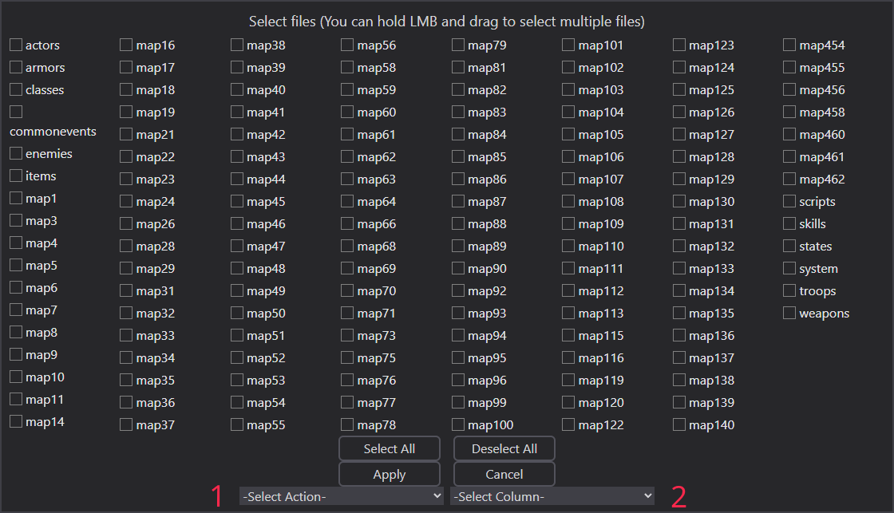

# Batch Processing

RPGMTranslate provides the features to batch-process translation files.

## Batch Menu

Almost everything in batch menu is self-explanatory, except action and column.

## Batch Action

There are three batch actions:

1. Trim.
2. Translate.
3. Wrap.

### Trim Fields

Removes leading and trailing whitespace from translation text.

### Translate Fields

Automatically translates source text and fills empty fields. Does not affect fields that already have translations.

### Wrap Lines in Fields

WARNING: This is the most dangerous tool.

The tool:

- Lets you input maximum line length
- Wraps text at specified length
- Moves excess content to new lines

Note: This may make your translation display incorrectly, so USE WITH CAUTION.

## Translation Column

You can select the desired translation column to apply batch processing. Selecting it is required.
