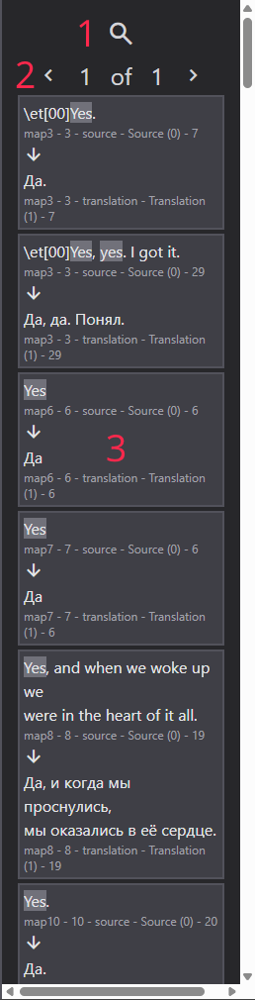

# Search Features

## Search Window Layout

The search interface contains:

1.  Search input field (supports multi-line text)
2.  Replace button for replacing all matches
3.  Put button for transferring text to translation field
4.  Replace input field (supports multi-line text)
5.  Search pattern buttons:
    - Case-sensitive search (Alt + C)
    - Whole word search (Alt + W)
    - Regex search (Alt + R)
    - Current tab only search (Alt + L)
6.  Search mode selector (source or translation text)

Note: The Put button matches source text as a whole, not line by line.

## Implementation Details

The search functionality is optimized with:

- Maximum 1000 search entries in memory
- Results split across multiple files, that you switch in search results panel

## Search Results Panel

Panel components:

1.  Search/log mode toggle
2.  Match pages navigation
3.  Matched text and metadata
4.  Corresponding text and metadata

Interaction:

- R: Open and close the panel
- Left-click: Navigate to text location
- Right-click: Replace matched text with replace input's text
- Middle-click: Put text from replace input to the textarea of matched source text

Note: Consider testing search patterns on a small subset before performing large-scale replacements.

## Regular Expression Support

Honestly, you can just fucking open Visual Studio Code and other shit to make sure you can revert all the damage you did with your shitty regexes, if you want to use them.
But if you want to use regex in the program, here's a quick breakdown:

- The program uses JavaScript implementation of regex. It's not as cool as Perl's, but it is, for example, used in VSCode.
- `$` substitutions are allowed.
- The program fully probably supports Unicode in regex.

Example of searching for `\c` pattern:

## Put

To perform global put, you can use the button in search menu, or you can perform single put, using middle-click on a one of search results.

How put works:

- Global put: Searches source text, that **exactly** matches the text in search input. Then, puts the text from replace input to the translation textarea of the source text. It overwrites existing translation, so be careful.
- Single put: Puts the text from replace input to the translation textarea of the source text. It overwrites existing translation, so be careful.
