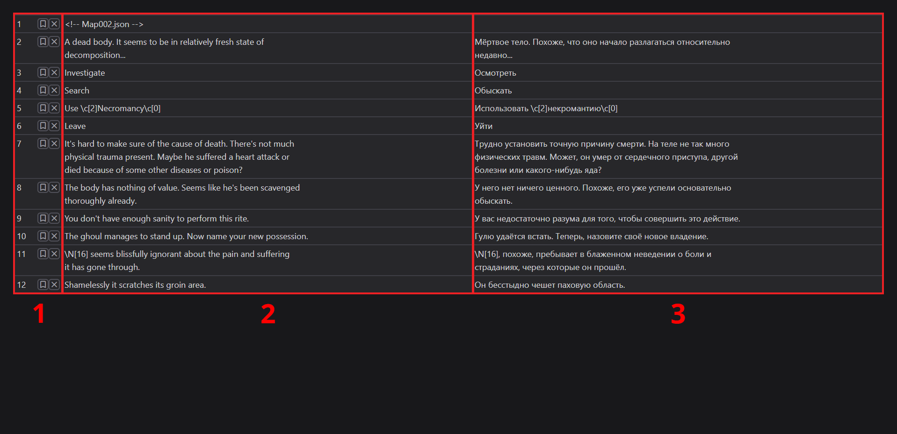

# Text Editing

## Editing Area Layout

The editing interface contains:

1.  Information column with:
    - Row numbers
    - Bookmark toggles
    - Delete buttons
2.  Source text column
3.  Translation text column

## Keyboard Shortcuts

You can edit the translation textarea like any other website input field. Available shortcuts:

- Alt + Enter - Move to next row (down)
- Ctrl + Enter - Move to previous row (up)
- Ctrl + T - Machine translation:
    - First press: Show translated text
    - Second press: Apply translation
- Left-click on source text - Copy the source text

Note: The program currently only supports Google Translate, and translation languages must be configured in options.

## Text Editing Tools

Access these through the "Tools" button:

### Trim Fields

Removes leading and trailing whitespace from translation text.

### Translate Fields

Automatically translates source text and fills empty fields. Does not affect fields that already have translations.

### Wrap Lines in Fields

WARNING: This is the most dangerous tool.

The tool:

- Lets you input maximum line length
- Wraps text at specified length
- Moves excess content to new lines

Note: This may make your translation display incorrectly, so USE WITH CAUTION.
