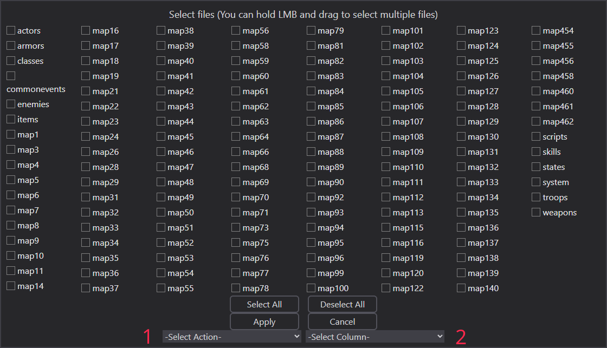

# Массовая обработка

RPGMTranslate предоставляет функционал для массовой обработки файлов.

## Меню обработки

Почти всё в меню обработки не нужно объяснять, кроме действия и столбца.

## Массовое действие

Есть три массовых действия:

1. Тримминг.
2. Перевод.
3. Перенос.

### Тримминг полей

Удаляет начальные и конечные пробелы из текста перевода.

### Перевод полей

Автоматически переводит исходный текст и заполняет пустые поля. Не влияет на поля, в которых уже есть перевод.

### Перенос строк в полях

ВНИМАНИЕ: Это самый опасный инструмент.

Инструмент:

- Позволяет ввести максимальную длину строки.
- Переносит текст на новую строку, если он превышает заданную длину.

Примечание: Это может привести к неправильному отображению перевода, поэтому ИСПОЛЬЗУЙТЕ ЕГО С ОСТОРОЖНОСТЬЮ.

## Столбец перевода

Вы можете выбрать желаемый столбец перевода, чтобы применить на нём массовую обработку. Без этого нельзя.
