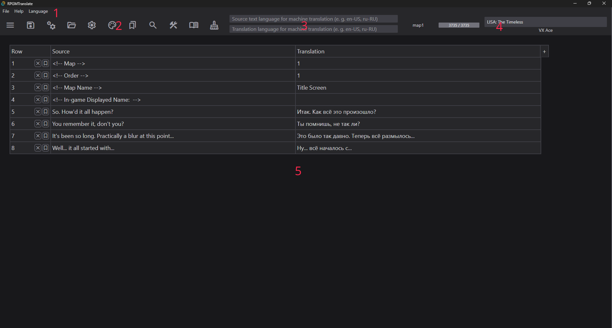

# Первый запуск

RPGMTranslate - это открытый и простой инструмент перевода для игр RPG Maker. Его основная сила заключается в поддержании простой файловой структуры и использовании файлов перевода обычного текста.

Для более подробного использования обратитесь к разделам:

- [Функции поиска](search.md)
- [Редактирование текста](text-editing.md)
    - [Массовая обработка](batch-processing.md)
- [Настройки](settings.md)
- [Чтение](read.md)
- [Чистка](purge.md)

**Также, помогите нам улучшить [документацию](https://github.com/RPG-Maker-Translation-Tools/rpgmtranslate/tree/main/docs/docs/ru)!**

## Установка

Загрузите последнюю версию с [GitHub](https://github.com/RPG-Maker-Translation-Tools/rpgmtranslate/releases/latest). Программа доступна в виде:

- Установщика Windows: `.msi` **рекомендуется** или `.exe`
- Пакета Linux: `.deb` или `.AppImage`
- Другие платформы: [Билдинг из исходного кода](build.md)

При первом запуске программа создает:

- Файл настроек: `КОРНЕВАЯ_ДИРЕКТОРИЯ/resources/settings.json`
- Файл тем: `КОРНЕВАЯ_ДИРЕКТОРИЯ/resources/themes.json`

Примечание: Если интерфейс не загружается, нажмите клавишу F12, чтобы открыть консоль для получения сообщений об ошибках.

## Оформление интерфейса

Скриншот показывает интерфейс программы с открытым проектом и вкладкой.

Быстрая пробежка:

1. Строка меню. Содержит меню `Файл`, `Помощь` и `Язык`.
2. Кнопки панели инструментов. Кнопки по порядку: панели вкладок, сохранения, записи, открытия, настроек, тем, закладок, поиска, массовой обработки, чтения, чистки.
3. Поля ввода языков для машинного перевода.
4. Крайняя секция панели инструментов. Отображает название текущей вкладки, глобальный прогресс, движок игры, позволяет редактировать название игры .
5. Область содержимого вкладки. Здесь и происходит весь перевод. Она включает в себя столбец номера ряда, столбец исходного текста, и столбцы перевода, где каждый новый может быть создан кнопкой `+`. Названия столбцов перевода можно изменить.

Важные термины:

- "Чтение" - означает повторно перепарсить перевод, либо в режиме добавления, чтобы добавить новый текст к переводу после обновления игры, либо принудительно переписать перевод и начать с нуля.
- "Скомпилировать" - означает записать перевод обратно в исходные файлы
- "Проект" - это директория, содержащая РПГ Мейкер игру
- "Вкладка" - это пункт меню вкладок, который открывает определенный файл

Горячие клавиши:

- Ctrl и +: Увеличить масштаб
- Ctrl и -: Уменьшить масштаб

## Открытие проекта

1. Нажмите кнопку "Открыть директорию".
2. Выберите папку с игрой RPG Maker
3. Программа создаст директорию `.rpgmtranslate`, содержащую:
    - Файлы перевода в текстовом формате в `.rpgmtranslate/translation`.
    - Папку резервных копий в `.rpgmtranslate/backups`
4. Опционально, но рекомендуется: Инициализировать git-репозиторий и периодически коммитить файлы.

Если в папке с игрой уже есть папка `translation`, её содержимое будет скопировано в `.rpgmtranslate/translation`, но не наоборот. Чтобы вернуть перевод в `ПАПКА_ИГРЫ/translation`, вам придется скопировать его вручную. Это сделано так, чтобы обеспечить максимальную безопасность, и избежать потери перевода.

The game's title, engine, current opened tab and translation progress will Название игры, движок, текущая открытая вкладка и прогресс перевода будут отображаться в правом верхнем углу интерфейса.

Название доступно для редактирования, оно будет сохранено и правильно записано.

Примечание: По умолчанию программа создает резервные копии каждые 60 секунд и сохраняет до 99 резервных копий.
