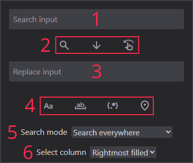
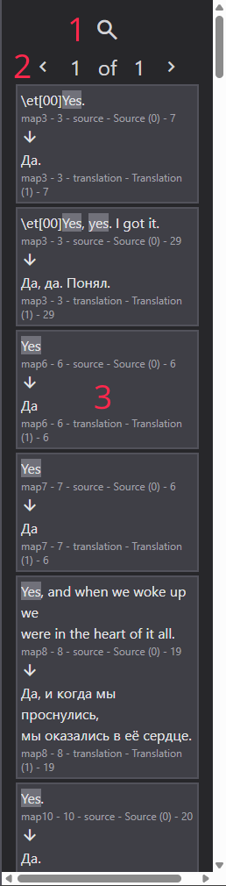
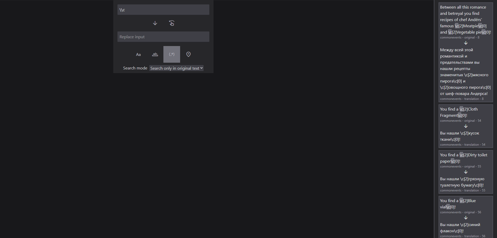

# Функции поиска

## Оформление меню поиска

Меню поиска содержит:

1. Поле поиска (поддерживает многострочный текст)
2. Кнопка поиска, замены текста, замещения текста.
3. Поле замены (поддерживает многострочный текст)
4. Кнопки поиска по паттерну:
    - Поиск с учетом регистра (Alt + C)
    - Поиск по всему слову (Alt + W)
    - Поиск по регулярным выражениям (Alt + R)
    - Поиск только по текущей вкладке (Alt + L)
5. Выбор режима поиска (оригинальный текст или перевод)
6. Выбор столбца перевода

## Поиск

Поиск может быть использован после помещения текста в поле поиска, и активации через Enter или кнопку.

В зависимости от активных паттернов поиска, поиск будет действовать по разному.

### Подробности реализации

Функциональность поиска оптимизирована следующим образом:

- Максимум 1000 результатов поиска в памяти
- Распределение результатов по нескольким файлам, которые вы переключаете на панели результатов поиска

### Панель результатов поиска

Компоненты панели:

1. Переключение режима поиска/журнала
2. Навигация по страницам результатов
3. Найденный текст

Взаимодействие:

- R: открыть или закрыть панель
- Левая кнопка мыши: перейти к расположению текста
- Правая кнопка мыши: заменить найденный текст на текст из поля замены
- Ctrl + ЛКМ: Скопировать найденный текст
- Средняя кнопка мыши: Заместить текст в поле перевода на текст из поля замены

Примечание: Перед выполнением масштабных замен рекомендуется протестировать паттерны поиска на чём-нибудь.

### Поддержка регулярных выражений

Честно говоря, вы можете просто блять открыть Visual Studio Code или какое-нибудь другое дерьмо, чтобы убедиться, что вы сможете откатить все изменения, которые сделали своими говнистым регексами, если вы всё же хотите их использовать.

Всё же, вот быстрая пробежка по тому, что вам нужно знать:

- Программа использует JavaScript имплементацию регексов. Она не такая крутая, как в Perl, но используется в VSCode.
- Замены с помощью `$` разрешены.
- Наверное, программа полностью поддерживает юникод.

Пример поиска паттерна `\c`:

## Замена

Глобальная замена используется, чтобы глобально заменить текст из поля поиска на текст из поля замены.

Если вы не уверены насчёт замены, сначала воспользуйтесь поиском, пройдитесь через его результаты, и если всё окей, тогда уже используйте замену. Ещё вы можете произвести одиночную замену, нажав на один из результатов поиска правой кнопкой мыши.

В зависимости от активных паттернов поиска, поиск будет действовать по разному.

## Замещение

Глобальное замещение используется, чтобы глобально заместить текст из поля перевода на текст из поля замены, если исходный текст совпадает с искомым.

Замещение - безумно опасная штука, так как заместит существующий перевод в поле. Так что убедитесь, что вы не перезаписываете ничего важного. Вы также можете произвести одиночное замещение, нажав на один из результатов поиска средней кнопкой мыши.

Глобальное замещение немного отличается от поиска, так как оно будет искать текст от его начала и до самого конца.

Например, если вы хотите заместить текст там, где исходный текст это `привет`, вы должны будете ввести `привет` в поле поиска, но это не приведёт к замещению текста там, где исходный текст содержит что-то кроме `привет`.

Для мощный замещений, вы можете использовать регулярные выражения. Они действуют также, но вы можете изменить это с помощью "жадных" опций `*` и `+`. К примеру, `привет .+` заместит как `привет мир`, так и `привет Rust`, `привет что угодно` и так далее.

В зависимости от активных паттернов поиска, поиск будет действовать по разному.
