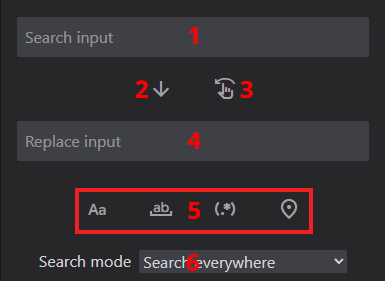

# Функции поиска

## Оформление окна поиска

Интерфейс поиска содержит:

1. Поле поиска (поддерживает многострочный текст)
2. Кнопка замены всех совпадений
3. Кнопка для вставки перевода
4. Поле замены (поддерживает многострочный текст)
5. Кнопки поиска по шаблону:
    - Поиск с учетом регистра (Alt + C)
    - Поиск по всему слову (Alt + W)
    - Поиск по регулярным выражениям (Alt + R)
    - Поиск только по текущей вкладке (Alt + L)
6. Выбор режима поиска (оригинальный текст или перевод)

Примечание: Кнопка вставки ищет исходный текст целиком, а не по линиям.

## Подробности реализации

Функциональность поиска оптимизирована следующим образом:

- Максимум 1000 результатов поиска в памяти
- Распределение результатов по нескольким файлам, которые вы переключаете на панели результатов поиска

## Поддержка регулярных выражений

Честно говоря, вы можете просто нахуй открыть Visual Studio Code или какое такое дерьмо, чтобы убедиться, что вы сможете исправить весь ущерб, который вы нанесли своими говнистыми регулярными выражениями, если хотите их использовать.

Но если вы хотите использовать регулярные выражения в программе, вот краткое описание:

- Программа использует JavaScript-реализацию регулярных выражений. Это не так круто, как в Perl, но, например, используется в VSCode.
- Программа, вероятно, полностью поддерживает юникод в регулярных выражениях.

Пример поиска по шаблону `\c`:

Примечание: Использование регулярного выражения в замене (например, с помощью $1) не сработает. Замена является буквальной.

## Панель результатов поиска

Компоненты панели:

1. Переключение режима поиска/журнала
2. Навигация по страницам результатов
3. Найденный текст и метаданные
4. Соответствующий текст и метаданные

Взаимодействие:

- R: открыть или закрыть панель
- Клик левой кнопкой мыши: перейти к расположению текста
- Клик правой кнопкой мыши: заменить найденный текст на текст из поля замены

Примечание: Перед выполнением масштабных замен рекомендуется протестировать паттерны поиска на чём-нибудь.
