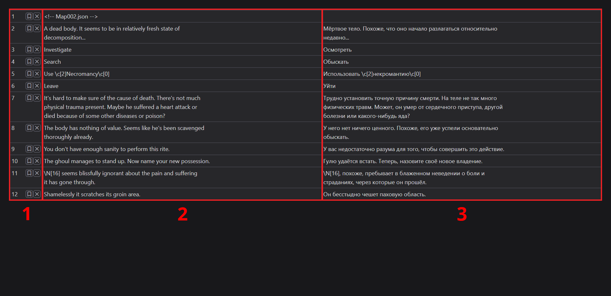

# Редактирование текста

## Оформление области редактирования

Интерфейс редактирования содержит:

1. Столбец информации с:
    - Номерами строк
    - Переключателями закладок
    - Кнопками удаления
2. Столбец исходного текста
3. Столбец перевода

## Сочетания клавиш

Вы можете редактировать текстовую область перевода, как и любое другое поле ввода на веб-сайтах в интернете. Доступные сочетания клавиш:

- Alt + Enter - переход к следующей строке (вниз)
- Ctrl + Enter - переход к предыдущей строке (вверх)
- Ctrl + T - машинный перевод:
    - Первое нажатие: отобразить переведенный текст
    - Второе нажатие: применить перевод
- Клик левой кнопкой мыши на исходном тексте - скопировать исходный текст

Примечание: В настоящее время программа поддерживает только Google Translate, и языки перевода должны быть настроены в настройках.

## Инструменты редактирования текста

Доступ к ним осуществляется с помощью кнопки "Инструменты":

### Тримминг полей

Удаляет начальные и конечные пробелы из текста перевода.

### Перевод полей

Автоматически переводит исходный текст и заполняет пустые поля. Не влияет на поля, в которых уже есть перевод.

### Перенос строк в полях

ВНИМАНИЕ: Это самый опасный инструмент.

Инструмент:

- Позволяет ввести максимальную длину строки
- Переносит текст на новую строку, если он превышает заданную длинну

Примечание: Это может привести к неправильному отображению перевода, поэтому ИСПОЛЬЗУЙТЕ ЕГО С ОСТОРОЖНОСТЬЮ.
